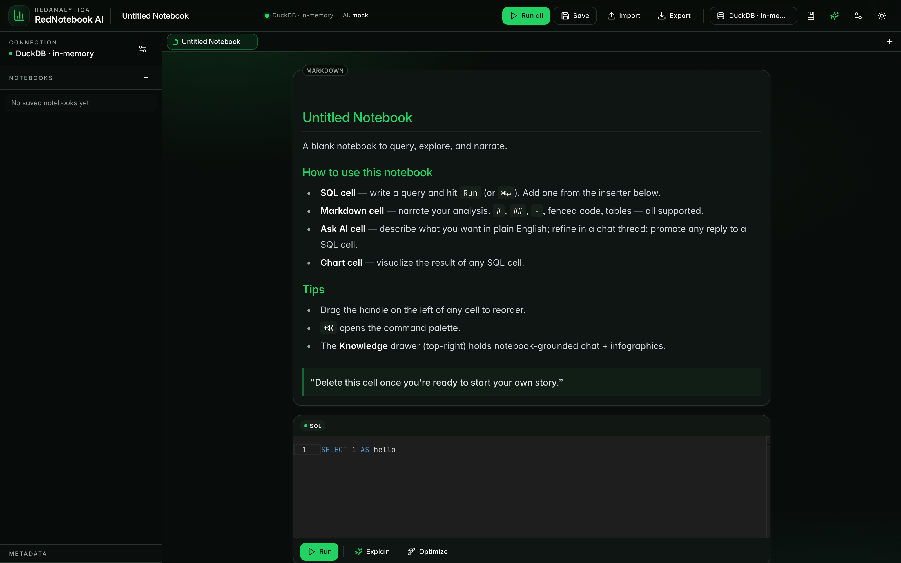
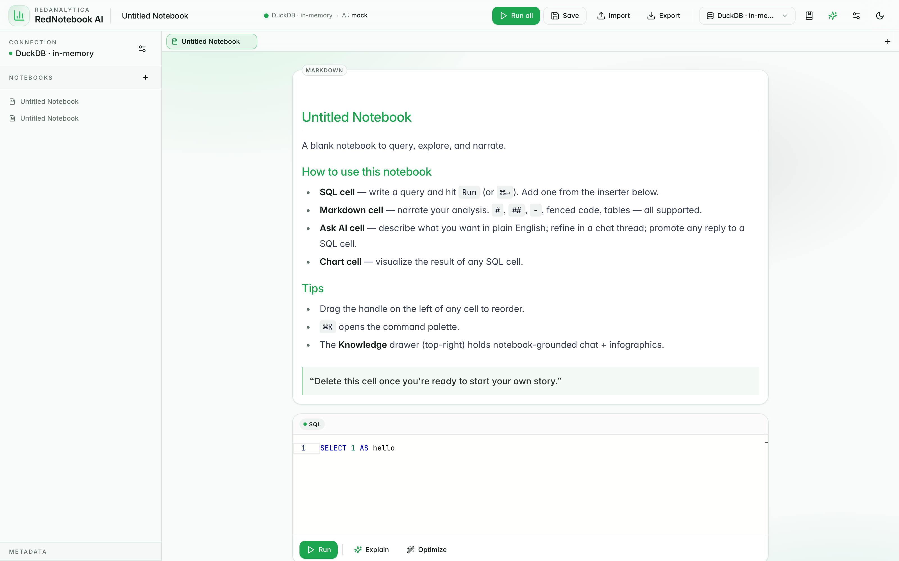

<div align="center">


# RedNotebook AI

**The open-source AI data notebook for Trino.**
By [RedAnalytica](https://redanalytica.in).

[](https://github.com/sanniheruwala/RedNotebookAI/actions/workflows/ci.yml)
[](https://github.com/sanniheruwala/RedNotebookAI/actions/workflows/release.yml)
[](LICENSE)
[](https://www.python.org/)
[](https://nextjs.org/)

Query, visualize, profile, and explore data with beautiful charts, AI suggestions, and a NotebookLM-style knowledge layer.

</div>

<picture>
  <source media="(prefers-color-scheme: light)" srcset="docs/images/screenshot-light.png">
  
</picture>

<details>
<summary><sub>Light theme preview</sub></summary>



</details>

---

## Why RedNotebook AI?

Modern data teams jump between five tools to answer one question. RedNotebook AI puts all of it in one notebook:

- **A real SQL workspace** with Monaco, AG Grid, drag-to-reorder cells, and keyboard shortcuts.
- **Premium charts** powered by Apache ECharts with brand-aware theming.
- **AI you can trust**, pluggable across OpenAI, Anthropic, Ollama, or a deterministic offline mock. Privacy-safe by default, schema-only context, PII masking, secrets stripped.
- **NotebookLM-style knowledge layer.** Pull SQL, schemas, results, and charts into a notebook of sources. Ask grounded questions. Generate infographics.
- **Read-only by default.** A SQL guard backed by `sqlglot` blocks destructive statements unless you explicitly enable writes.
- **Local-first.** Runs on your laptop with no login. Flip a single env var (`AUTH_ENABLED=true`) to enable multi-user mode with local email+password, GitHub OAuth, API tokens, per-user namespacing, and admin invites.

---

## Install

### Docker (any OS)

```bash
docker run -d --name rednotebook \
  -p 8000:8000 \
  -v rednotebook-data:/data \
  ghcr.io/sanniheruwala/rednotebook-ai:latest
```

Then open [http://localhost:8000](http://localhost:8000).

Or with Compose:

```bash
cp .env.example .env  # edit as needed
docker compose up -d
```

### Python

```bash
pip install rednotebook-ai          # from PyPI (when a release is tagged)
rednotebook run                      # starts the FastAPI server on :8000
```

Then in a second terminal:

```bash
cd frontend
npm install
npm run dev                          # starts the dev UI on :3000
```

### From source

```bash
git clone https://github.com/sanniheruwala/RedNotebookAI.git
cd RedNotebookAI
python -m venv .venv && source .venv/bin/activate
pip install -e ".[dev]"
cp .env.example .env
rednotebook run

# in another terminal
cd frontend && npm install && npm run dev
```

---

## Where can I run this safely?

RedNotebook AI is local-first. Today:

| Tier | Supported? |
|------|------------|
| 🟢 **Your laptop** (`localhost`) | ✅ Primary use case |
| 🟢 **Single team behind VPN / private network** | ✅ With the [hardening checklist](docs/deployment.md#tier-2--single-team-behind-a-vpn--private-network) |
| 🔴 **Public internet, multi-user SaaS** | ⚠️ Auth landed; rate-limiting + audit log are on the [Phase 4 roadmap](docs/roadmap.md). |

See [`docs/deployment.md`](docs/deployment.md) for the full security model.

---

## Pick a data source

In the UI top bar, click **Configure connection**.

### Option A: DuckDB (no server, instant)

The default. Pick "DuckDB (no server)" in the dialog. Two modes:

- **In-memory** (`:memory:`) — ephemeral playground. Great for one-off SQL against local files: `SELECT * FROM read_csv_auto('orders.csv') WHERE …`
- **File** (`./local.duckdb`) — persistent. Use it like a single-user warehouse: `CREATE TABLE customers (…)`, `INSERT …`, etc.

Optionally set a "Working directory" so relative file paths in `read_csv_auto` / `read_parquet` resolve where you expect.

### Option B: Trino HTTPS

For team analytics on real data warehouses. In the UI dialog, fill in host/port/user/password/catalog/schema. Or set defaults in `.env`:

```env
TRINO_HOST=trino.example.com
TRINO_PORT=443
TRINO_SCHEME=https
TRINO_USER=alice
TRINO_PASSWORD=...
TRINO_CATALOG=hive
TRINO_SCHEMA=default
TRINO_VERIFY_SSL=true
```

Custom HTTP headers, session properties, query timeouts, and result limits are all supported.

---

## Configure AI

| Provider | Setup |
|----------|-------|
| **Mock** (default) | Offline, deterministic. No setup. |
| **OpenAI** | `AI_PROVIDER=openai`, `OPENAI_API_KEY=sk-…` |
| **Anthropic** | `AI_PROVIDER=anthropic`, `ANTHROPIC_API_KEY=sk-ant-…` |
| **Ollama** (local) | `AI_PROVIDER=ollama`, `OLLAMA_BASE_URL=http://localhost:11434` |

Privacy defaults:

- Sample rows are **not** sent to AI unless `AI_ALLOW_SAMPLE_ROWS=true`.
- PII columns are masked when samples are shared.
- Secrets are stripped from SQL before any provider call.
- Credentials are never forwarded to AI.

See [`docs/ai.md`](docs/ai.md) for details.

---

## Enable multi-user (optional)

```env
AUTH_ENABLED=true
SECRET_KEY=$(openssl rand -hex 32)
COOKIE_SECURE=true              # set true when behind HTTPS
ALLOW_SELF_SIGNUP=false         # admin-invite only by default
```

The first registration becomes the workspace admin. Subsequent users need an invite (`POST /api/auth/invite`). GitHub OAuth and API tokens (PAT-style) are supported out of the box. See [`docs/deployment.md`](docs/deployment.md).

---

## Architecture

| Layer | Tech |
|-------|------|
| Backend | Python 3.11+, FastAPI, Pydantic, Trino client, Pandas, ECharts/Plotly |
| Frontend | Next.js 14, TypeScript, Tailwind, shadcn/ui, Monaco, AG Grid, ECharts, framer-motion, @dnd-kit |
| State | TanStack Query (server) + Zustand (local) |
| Auth | Local email+password (bcrypt) + JWT cookies, GitHub OAuth, API tokens |
| AI | Provider-pluggable (mock, OpenAI, Anthropic, Ollama) |
| Storage | Local JSON for notebooks/knowledge/users; optional Parquet result cache |

```
rednotebook/        Python backend (FastAPI + core libs)
├── auth/           User store, JWT sessions, password hashing, OAuth, API tokens
├── server/         FastAPI app + routers
├── connectors/     Trino + base plugin interface
├── ai/             Provider abstraction (mock, openai, anthropic, ollama)
├── notebook/       Notebook models, JSON storage, guard-aware runner
├── knowledge/      NotebookLM-style internal knowledge layer
├── visualization/  Recommender, chart spec, HTML infographic generator
├── profiling/      Stats + PII detector
├── security/       SQL guard, secret masking
├── migrations/     One-shot data migrations
└── cli/            Typer CLI

frontend/           Next.js + Tailwind + shadcn/ui
docs/               Architecture, AI, security, deployment, connectors, roadmap
tests/              pytest test suite
```

Full [architecture write-up](docs/architecture.md).

---

## Documentation

- [Architecture](docs/architecture.md)
- [Deployment tiers](docs/deployment.md)
- [Connectors](docs/connectors.md)
- [AI providers and privacy](docs/ai.md)
- [Security model](docs/security.md)
- [Visualization](docs/visualization.md)
- [Knowledge layer + NotebookLM integration](docs/notebooklm_integration.md)
- [Roadmap](docs/roadmap.md)
- [Contributing](docs/contributing.md)

---

## Development

```bash
# Backend
pytest                              # 44+ tests
ruff check .

# Frontend
cd frontend
npm run typecheck
npm run lint
npm run build
```

Continuous integration runs the full suite on every push and PR. See [`.github/workflows`](.github/workflows).

---

## Contributing

Issues, PRs, and design feedback all welcome. See [`docs/contributing.md`](docs/contributing.md) and the [PR template](.github/pull_request_template.md). For vulnerabilities, please use [private disclosure](SECURITY.md), not a public issue.

---

## License

Apache-2.0. See [LICENSE](LICENSE).

<div align="center">
  <sub>Built with care by <a href="https://redanalytica.in">RedAnalytica</a>.</sub>
</div>
